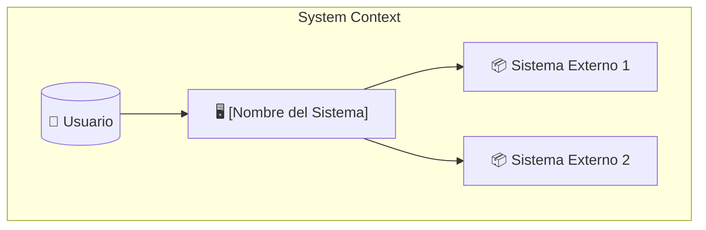
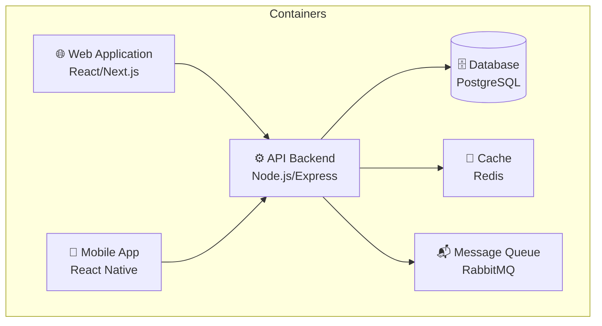
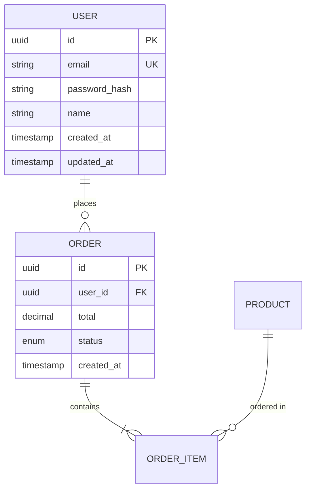

# Arquitectura: [Nombre del Proyecto]

## Metadata
| Campo | Valor |
|-------|-------|
| Versión | 1.0 |
| Fecha | [YYYY-MM-DD] |
| Autor | NXT Architect |
| Estado | [Draft/Review/Approved] |

---

## 1. Resumen de Arquitectura

### 1.1 Visión General
[Descripción de alto nivel del sistema y su propósito]

### 1.2 Principios de Arquitectura
1. **[Principio 1]**: [Descripción]
2. **[Principio 2]**: [Descripción]
3. **[Principio 3]**: [Descripción]

### 1.3 Restricciones
- [Restricción técnica 1]
- [Restricción de negocio 1]
- [Restricción de recursos 1]

---

## 2. Diagrama de Sistema (C4 Level 1)



### Descripción de Actores
| Actor | Descripción |
|-------|-------------|
| Usuario | [Descripción del usuario principal] |
| Sistema Externo 1 | [Descripción de la integración] |
| Sistema Externo 2 | [Descripción de la integración] |

---

## 3. Diagrama de Contenedores (C4 Level 2)



### Descripción de Contenedores
| Contenedor | Tecnología | Responsabilidad |
|------------|------------|-----------------|
| Web App | [Tech] | [Responsabilidad] |
| API | [Tech] | [Responsabilidad] |
| Database | [Tech] | [Responsabilidad] |
| Cache | [Tech] | [Responsabilidad] |

---

## 4. Tech Stack

### 4.1 Frontend
| Categoría | Tecnología | Versión | Justificación |
|-----------|------------|---------|---------------|
| Framework | [React/Vue/Angular] | [X.X] | [Por qué] |
| State Management | [Redux/Zustand/etc] | [X.X] | [Por qué] |
| Styling | [Tailwind/CSS Modules/etc] | [X.X] | [Por qué] |
| Build Tool | [Vite/Webpack/etc] | [X.X] | [Por qué] |

### 4.2 Backend
| Categoría | Tecnología | Versión | Justificación |
|-----------|------------|---------|---------------|
| Runtime | [Node/Python/Go] | [X.X] | [Por qué] |
| Framework | [Express/FastAPI/etc] | [X.X] | [Por qué] |
| ORM | [Prisma/TypeORM/etc] | [X.X] | [Por qué] |
| Validation | [Zod/Joi/etc] | [X.X] | [Por qué] |

### 4.3 Base de Datos
| Categoría | Tecnología | Versión | Justificación |
|-----------|------------|---------|---------------|
| Principal | [PostgreSQL/MongoDB/etc] | [X.X] | [Por qué] |
| Cache | [Redis/Memcached] | [X.X] | [Por qué] |
| Search | [Elasticsearch/Algolia] | [X.X] | [Por qué] |

### 4.4 Infraestructura
| Categoría | Tecnología | Justificación |
|-----------|------------|---------------|
| Cloud Provider | [AWS/GCP/Azure] | [Por qué] |
| Container | [Docker] | [Por qué] |
| Orchestration | [K8s/ECS/etc] | [Por qué] |
| CI/CD | [GitHub Actions/GitLab CI] | [Por qué] |

---

## 5. Componentes del Sistema

### 5.1 [Componente 1: Nombre]
| Atributo | Valor |
|----------|-------|
| Responsabilidad | [Qué hace] |
| Tecnología | [Tech stack] |
| Dependencias | [De qué depende] |
| APIs Expuestas | [Qué APIs expone] |

### 5.2 [Componente 2: Nombre]
[Repetir estructura]

---

## 6. API Design

### 6.1 Estilo de API
- Tipo: [REST/GraphQL/gRPC]
- Versionamiento: [URL path/Header/Query param]
- Autenticación: [JWT/OAuth/API Key]

### 6.2 Endpoints Principales

#### [Recurso 1]
| Método | Endpoint | Descripción | Auth |
|--------|----------|-------------|------|
| GET | /api/v1/[recurso] | Lista [recursos] | ✓ |
| GET | /api/v1/[recurso]/:id | Obtiene un [recurso] | ✓ |
| POST | /api/v1/[recurso] | Crea [recurso] | ✓ |
| PUT | /api/v1/[recurso]/:id | Actualiza [recurso] | ✓ |
| DELETE | /api/v1/[recurso]/:id | Elimina [recurso] | ✓ |

### 6.3 Formato de Respuesta
```json
{
  "success": true,
  "data": {},
  "meta": {
    "page": 1,
    "total": 100
  }
}
```

### 6.4 Formato de Error
```json
{
  "success": false,
  "error": {
    "code": "ERROR_CODE",
    "message": "Human readable message",
    "details": []
  }
}
```

---

## 7. Modelo de Datos

### 7.1 Diagrama ER


### 7.2 Descripción de Entidades

#### User
| Campo | Tipo | Constraints | Descripción |
|-------|------|-------------|-------------|
| id | UUID | PK | Identificador único |
| email | VARCHAR(255) | UK, NOT NULL | Email del usuario |
| password_hash | VARCHAR(255) | NOT NULL | Hash del password |

[Repetir para otras entidades]

---

## 8. Seguridad

### 8.1 Autenticación
- Método: [JWT/Session/OAuth]
- Token expiry: [Tiempo]
- Refresh strategy: [Estrategia]

### 8.2 Autorización
- Modelo: [RBAC/ABAC]
- Roles definidos:
  | Rol | Permisos |
  |-----|----------|
  | Admin | [Permisos] |
  | User | [Permisos] |

### 8.3 Seguridad de Datos
- Encriptación at rest: [Sí/No - Método]
- Encriptación in transit: [TLS versión]
- PII handling: [Cómo se maneja]

### 8.4 OWASP Considerations
- [ ] SQL Injection: [Mitigación]
- [ ] XSS: [Mitigación]
- [ ] CSRF: [Mitigación]
- [ ] Authentication: [Mitigación]

---

## 9. Escalabilidad

### 9.1 Estrategia de Escalamiento
| Componente | Estrategia | Trigger |
|------------|------------|---------|
| API | Horizontal | CPU > 70% |
| Database | Vertical + Read replicas | Connections > X |
| Cache | Cluster | Memory > 80% |

### 9.2 Caching Strategy
| Nivel | Qué se cachea | TTL | Invalidación |
|-------|---------------|-----|--------------|
| CDN | Assets estáticos | 1 año | Deploy |
| Redis | Sesiones | 24h | Logout |
| Redis | Queries frecuentes | 1h | Write |

---

## 10. Observabilidad

### 10.1 Logging
- Nivel: [DEBUG/INFO/WARN/ERROR]
- Formato: [JSON/Text]
- Almacenamiento: [ELK/CloudWatch/etc]

### 10.2 Metrics
- Herramienta: [Prometheus/DataDog/etc]
- Métricas clave:
  - Request rate
  - Error rate
  - Latency (p50, p95, p99)

### 10.3 Tracing
- Herramienta: [Jaeger/X-Ray/etc]
- Sampling: [X%]

### 10.4 Alerting
| Alerta | Condición | Severity | Acción |
|--------|-----------|----------|--------|
| High error rate | Error > 5% | Critical | Page on-call |
| High latency | p95 > 500ms | Warning | Slack notification |

---

## 11. Deployment

### 11.1 Ambientes
| Ambiente | URL | Propósito |
|----------|-----|-----------|
| Development | dev.example.com | Desarrollo local |
| Staging | staging.example.com | QA y testing |
| Production | example.com | Usuarios finales |

### 11.2 CI/CD Pipeline
```
Code Push → Lint → Test → Build → Deploy to Staging → QA → Deploy to Prod
```

### 11.3 Rollback Strategy
[Descripción de cómo hacer rollback]

---

## 12. ADRs (Architecture Decision Records)

| ID | Decisión | Fecha | Estado |
|----|----------|-------|--------|
| ADR-001 | [Título] | [Fecha] | Accepted |
| ADR-002 | [Título] | [Fecha] | Accepted |

Ver detalles en `docs/3-solutioning/adrs/`

---

## Aprobaciones

| Rol | Nombre | Fecha | Firma |
|-----|--------|-------|-------|
| Architect | NXT Architect | | |
| Tech Lead | NXT Tech Lead | | |
| Dev | NXT Dev | | |
