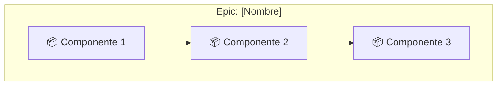

# Tech Spec: [Epic Name]

## Metadata
| Campo | Valor |
|-------|-------|
| Epic ID | [EPIC-ID] |
| Versión | 1.0 |
| Fecha | [YYYY-MM-DD] |
| Autor | NXT Architect |
| Estado | [Draft/Review/Approved] |

---

## 1. Resumen

### 1.1 Descripción del Epic
[Descripción breve del epic y su propósito]

### 1.2 Objetivos Técnicos
- [Objetivo técnico 1]
- [Objetivo técnico 2]
- [Objetivo técnico 3]

### 1.3 Alcance
**En alcance:**
- [Item 1]
- [Item 2]

**Fuera de alcance:**
- [Item 1]
- [Item 2]

---

## 2. Contexto

### 2.1 Del PRD
[Requisitos relevantes extraídos del PRD]

| RF ID | Requisito | Prioridad |
|-------|-----------|-----------|
| RF-XXX | [Descripción] | Must |
| RF-XXX | [Descripción] | Should |

### 2.2 De la Arquitectura
[Decisiones de arquitectura que aplican a este epic]

- Patrón: [Patrón a usar]
- Componentes involucrados: [Lista]
- APIs existentes: [Lista]

---

## 3. Diseño Técnico

### 3.1 Diagrama de Componentes



### 3.2 Nuevos Componentes a Crear

#### Componente: [Nombre]
| Atributo | Valor |
|----------|-------|
| Tipo | [Service/Controller/Component/etc] |
| Ubicación | `src/[path]/[nombre]` |
| Responsabilidad | [Qué hace] |
| Dependencias | [De qué depende] |

**Interfaz:**
```typescript
interface I[Nombre] {
  method1(param: Type): Promise<ReturnType>;
  method2(param: Type): ReturnType;
}
```

#### Componente: [Nombre 2]
[Repetir estructura]

### 3.3 Componentes Existentes a Modificar

| Componente | Ubicación | Modificación |
|------------|-----------|--------------|
| [Nombre] | `src/[path]` | [Qué se modifica] |

---

## 4. APIs

### 4.1 Nuevos Endpoints

#### POST /api/v1/[recurso]
**Descripción:** [Qué hace el endpoint]

**Request:**
```json
{
  "field1": "string",
  "field2": 123,
  "field3": {
    "nested": "value"
  }
}
```

**Response (200):**
```json
{
  "success": true,
  "data": {
    "id": "uuid",
    "field1": "string",
    "createdAt": "2024-01-01T00:00:00Z"
  }
}
```

**Response (400):**
```json
{
  "success": false,
  "error": {
    "code": "VALIDATION_ERROR",
    "message": "Invalid input",
    "details": [
      { "field": "field1", "message": "Required" }
    ]
  }
}
```

**Validaciones:**
- field1: Required, max 255 chars
- field2: Required, positive integer

#### GET /api/v1/[recurso]/:id
[Repetir estructura]

### 4.2 Endpoints Modificados

| Endpoint | Modificación |
|----------|--------------|
| GET /api/v1/[existente] | [Qué cambia] |

---

## 5. Modelo de Datos

### 5.1 Nuevas Entidades

#### Entity: [Nombre]
```sql
CREATE TABLE [nombre] (
  id UUID PRIMARY KEY DEFAULT gen_random_uuid(),
  field1 VARCHAR(255) NOT NULL,
  field2 INTEGER NOT NULL,
  field3_id UUID REFERENCES other_table(id),
  created_at TIMESTAMP DEFAULT CURRENT_TIMESTAMP,
  updated_at TIMESTAMP DEFAULT CURRENT_TIMESTAMP
);

CREATE INDEX idx_[nombre]_field1 ON [nombre](field1);
```

**Modelo en código:**
```typescript
interface [Nombre] {
  id: string;
  field1: string;
  field2: number;
  field3Id: string;
  createdAt: Date;
  updatedAt: Date;
}
```

### 5.2 Migraciones Necesarias

| Migración | Descripción | Reversible |
|-----------|-------------|------------|
| add_[tabla]_table | Crear tabla [nombre] | ✓ |
| add_[columna]_to_[tabla] | Agregar columna | ✓ |

---

## 6. Dependencias

### 6.1 Dependencias Externas (Nuevas)

| Paquete | Versión | Propósito |
|---------|---------|-----------|
| [package] | ^X.X.X | [Para qué] |

### 6.2 Dependencias Internas

| Módulo | Versión | Propósito |
|--------|---------|-----------|
| [módulo] | - | [Para qué] |

### 6.3 Servicios Externos

| Servicio | Propósito | Documentación |
|----------|-----------|---------------|
| [servicio] | [Para qué] | [URL] |

---

## 7. Criterios de Aceptación Técnicos

### 7.1 Performance
- Tiempo de respuesta API: < [X]ms (p95)
- Queries DB: < [X]ms
- Memoria máxima: [X]MB

### 7.2 Seguridad
- [ ] Input validation en todos los endpoints
- [ ] Autorización verificada
- [ ] No hay datos sensibles en logs

### 7.3 Testing
- [ ] Unit tests para servicios (coverage > 80%)
- [ ] Integration tests para endpoints
- [ ] Tests para migraciones

---

## 8. Plan de Implementación

### 8.1 Stories Sugeridas

| # | Story | Descripción | Puntos Est. |
|---|-------|-------------|-------------|
| 1 | Setup base | Crear estructura inicial | 2 |
| 2 | [Story 2] | [Descripción] | 3 |
| 3 | [Story 3] | [Descripción] | 5 |

### 8.2 Orden de Implementación

```
[Story 1] → [Story 2] → [Story 3]
     ↓
[Story 4] (puede ser paralela)
```

### 8.3 Dependencias entre Stories

| Story | Depende de |
|-------|------------|
| Story 2 | Story 1 |
| Story 3 | Story 1, Story 2 |

---

## 9. Riesgos Técnicos

| ID | Riesgo | Probabilidad | Impacto | Mitigación |
|----|--------|--------------|---------|------------|
| R1 | [Descripción] | [Alta/Media/Baja] | [Alto/Medio/Bajo] | [Plan] |
| R2 | [Descripción] | [Alta/Media/Baja] | [Alto/Medio/Bajo] | [Plan] |

---

## 10. Consideraciones de Rollback

### 10.1 Feature Flag
- Nombre: `feature_[nombre]_enabled`
- Default: `false`

### 10.2 Rollback de Migraciones
[Descripción de cómo revertir las migraciones si es necesario]

### 10.3 Rollback de Código
[Descripción de consideraciones especiales para rollback]

---

## 11. Checklist Pre-Implementación

- [ ] Tech spec revisado por Tech Lead
- [ ] Dependencias aprobadas
- [ ] Migraciones testeadas en staging
- [ ] Feature flag configurado
- [ ] Documentación de API actualizada

---

## Aprobaciones

| Rol | Nombre | Fecha |
|-----|--------|-------|
| Architect | NXT Architect | |
| Tech Lead | NXT Tech Lead | |
| Dev Lead | | |
