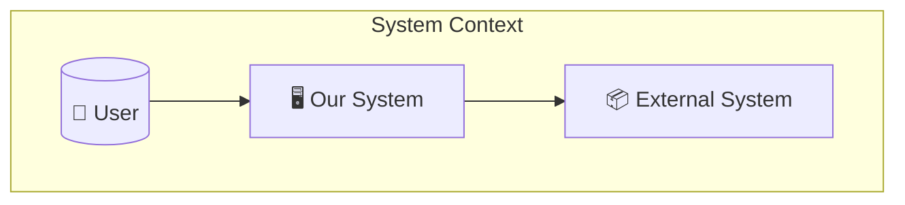
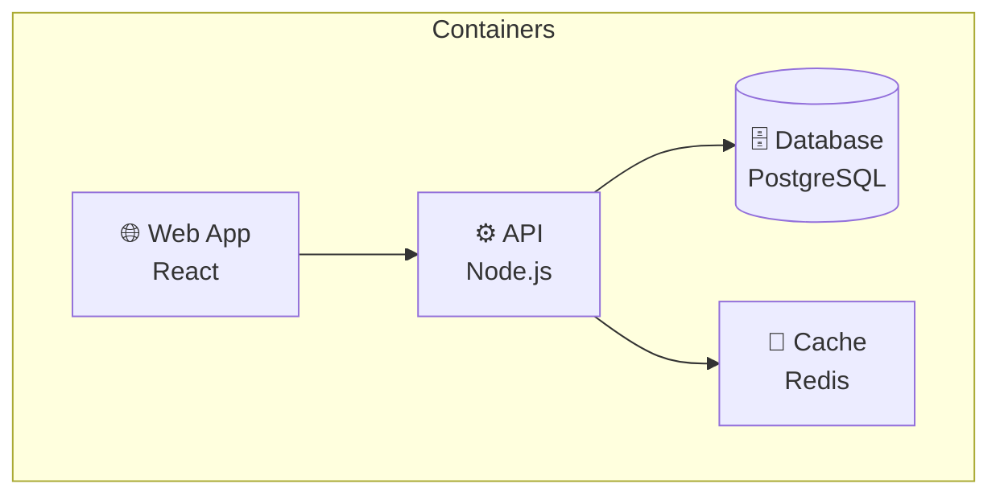
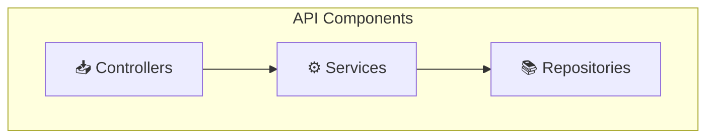
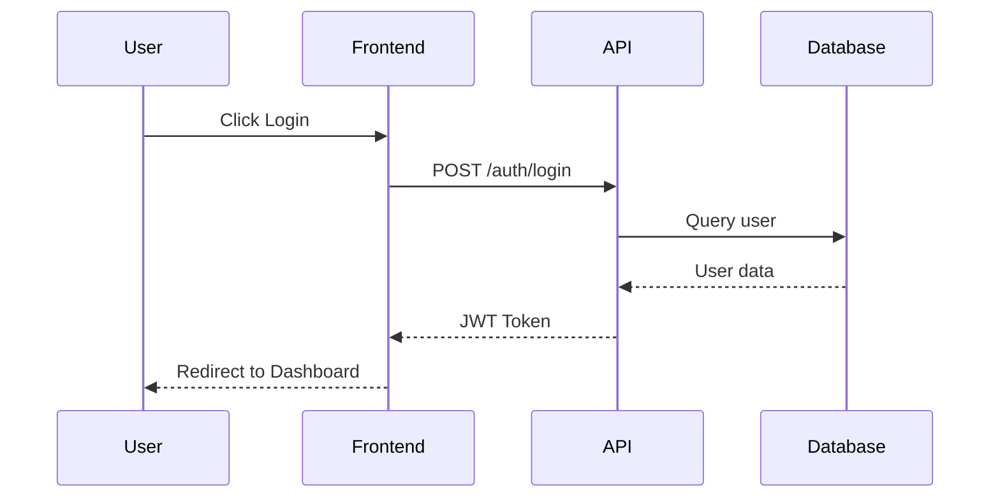
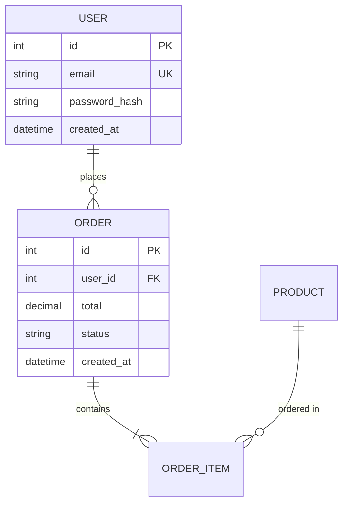
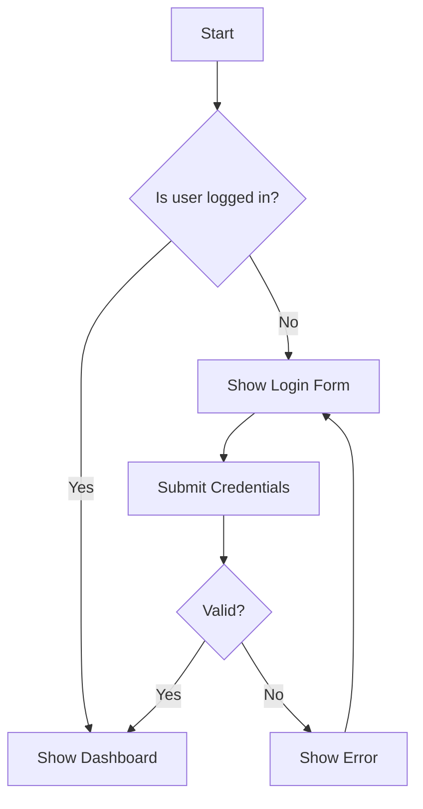
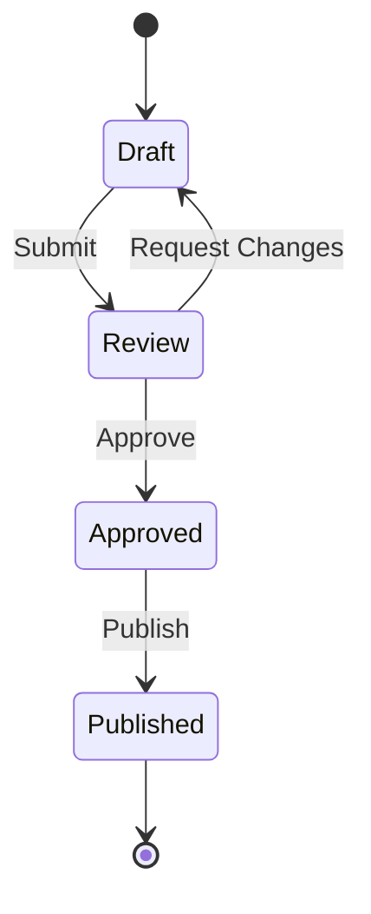

# NXT Diagrams Skill

## Propósito
Crear diagramas técnicos claros y profesionales.

## Cuándo se Activa
- Diagramas de arquitectura (C4)
- Sequence diagrams
- Flowcharts
- Entity Relationship Diagrams
- User flows
- State diagrams
- Deployment diagrams

## Instrucciones

### 1. Tipos de Diagramas

#### C4 Model (Arquitectura)

**Level 1: System Context**


**Level 2: Container Diagram**


**Level 3: Component Diagram**


#### Sequence Diagrams


#### Entity Relationship Diagram (ERD)


#### Flowcharts


#### State Diagrams


### 2. Paleta de Colores NXT

| Color | Hex | Uso |
|-------|-----|-----|
| Primary Blue | #3B82F6 | Elementos principales |
| Secondary Orange | #F97316 | Acciones, CTAs |
| Accent Purple | #8B5CF6 | Destacados |
| Success Green | #10B981 | Estados positivos |
| Warning Yellow | #F59E0B | Alertas |
| Error Red | #EF4444 | Errores |
| Neutral Gray | #6B7280 | Texto secundario |
| Background | #F9FAFB | Fondos |

### 3. Estilo de Diagramas

```mermaid
%%{init: {
  'theme': 'base',
  'themeVariables': {
    'primaryColor': '#3B82F6',
    'primaryTextColor': '#FFFFFF',
    'primaryBorderColor': '#2563EB',
    'lineColor': '#6B7280',
    'secondaryColor': '#F97316',
    'tertiaryColor': '#F9FAFB'
  }
}}%%
```

### 4. Convenciones

#### Naming
- Nodos: PascalCase o descriptivo
- Conexiones: verbos en minúscula
- Subgraphs: Títulos descriptivos

#### Iconos Comunes
- 👤 Usuario
- 🖥️ Sistema/Aplicación
- 🌐 Web
- ⚙️ API/Backend
- 🗄️ Base de datos
- 💾 Cache
- 📦 Servicio externo
- 📱 Mobile

### 5. Output

#### Formatos Disponibles
- **Mermaid**: Embebido en Markdown (preferido)
- **SVG**: Para documentos Word/PDF
- **PNG**: Para presentaciones
- **HTML**: Para diagramas interactivos

#### Ubicación
- `docs/diagrams/` - Diagramas generales
- `docs/3-solutioning/diagrams/` - Arquitectura
- Embebidos en documentos `.md`

## Ejemplos de Uso

```
"Crea un diagrama de arquitectura C4 nivel 2"
"Genera el ERD de la base de datos"
"Crea un sequence diagram del flujo de autenticación"
"Diseña el user flow para el proceso de checkout"
"Crea un state diagram para el ciclo de vida de un pedido"
"Genera el deployment diagram de la infraestructura"
```

## Buenas Prácticas

1. **Simplicidad**: No más de 7-10 elementos por diagrama
2. **Consistencia**: Usar mismos símbolos para mismos conceptos
3. **Jerarquía**: De lo general a lo específico
4. **Etiquetas**: Claras y concisas
5. **Dirección**: Flujo de arriba a abajo o izquierda a derecha
