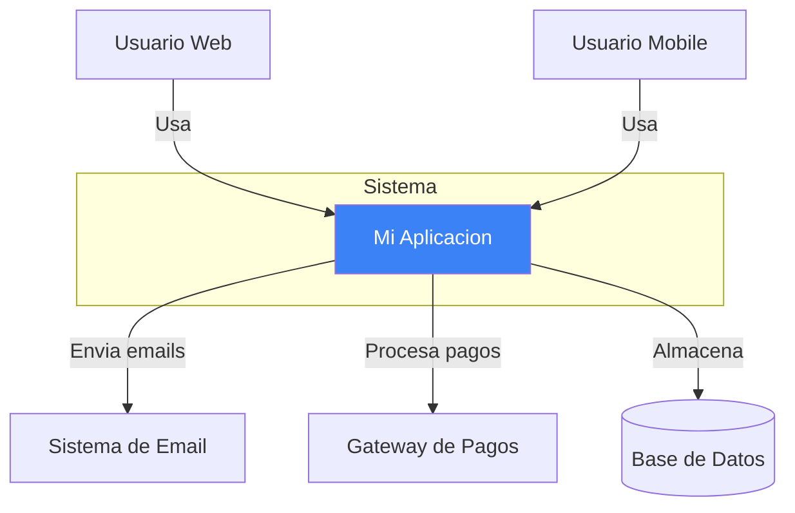
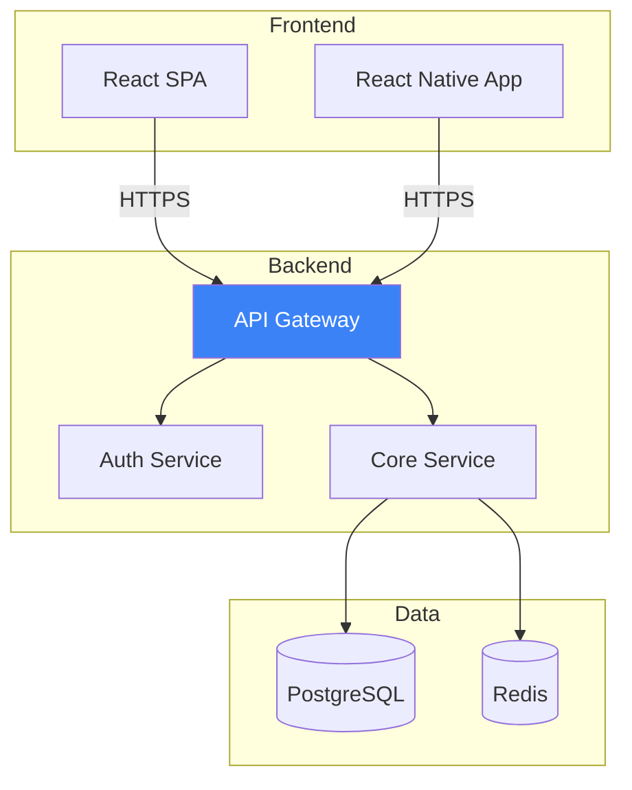
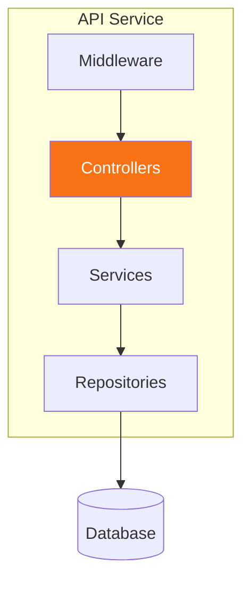
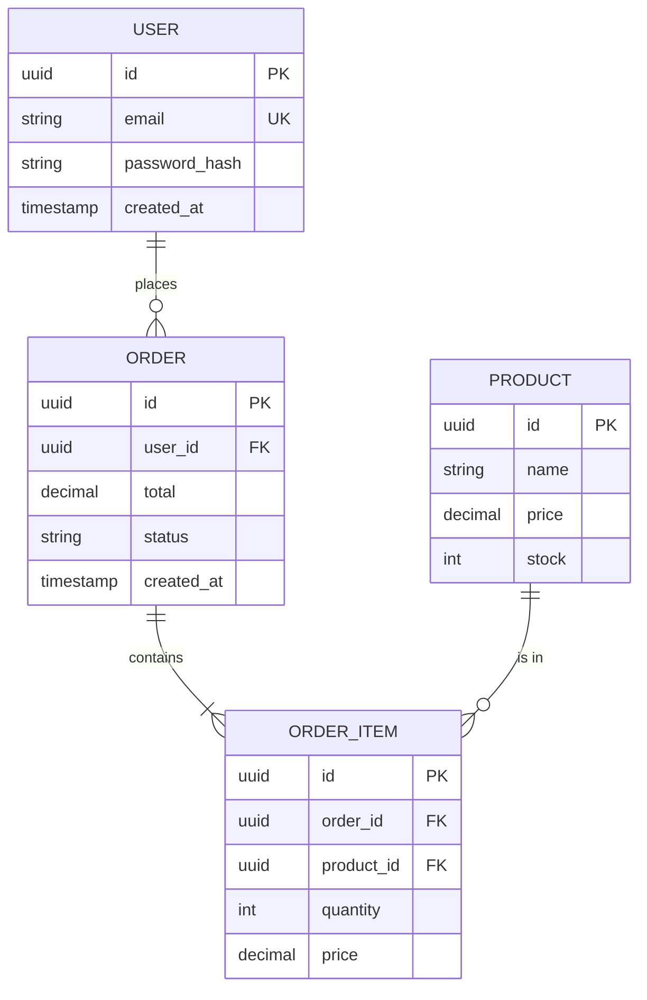
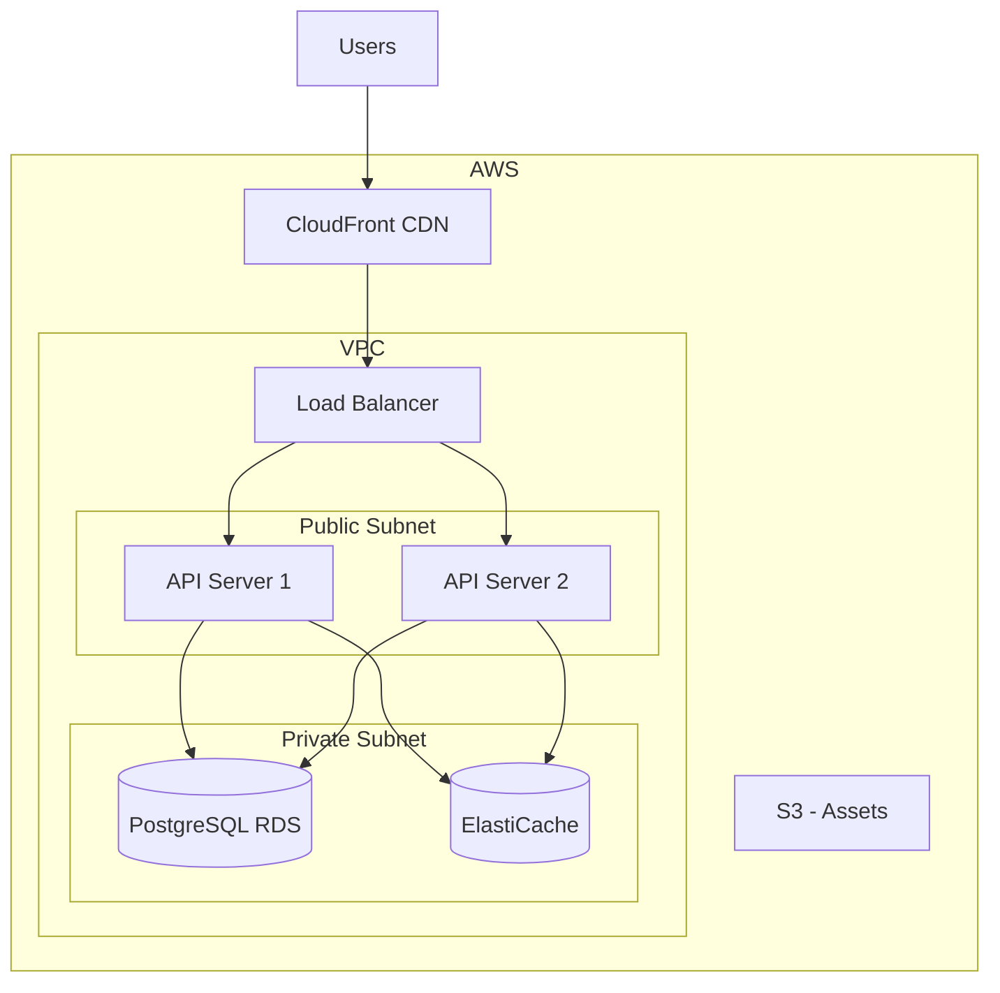

# Arquitectura: [Nombre del Sistema]

## Metadata
| Campo | Valor |
|-------|-------|
| Version | 1.0 |
| Fecha | [YYYY-MM-DD] |
| Autor | NXT Architect |
| Estado | Draft |

---

## 1. Vista General

### 1.1 Contexto del Sistema (C4 Level 1)

[Diagrama de contexto mostrando el sistema y sus interacciones externas]



### 1.2 Contenedores (C4 Level 2)

[Diagrama de contenedores mostrando los componentes principales]



---

## 2. Tech Stack

### 2.1 Stack Seleccionado

| Capa | Tecnologia | Version | Justificacion |
|------|------------|---------|---------------|
| Frontend | React | 18.x | Ecosistema maduro, equipo experimentado |
| UI Framework | Tailwind CSS | 3.x | Desarrollo rapido, customizable |
| Backend | Node.js + Express | 20.x | JavaScript fullstack, performance |
| Base de Datos | PostgreSQL | 15.x | ACID compliance, features avanzados |
| Cache | Redis | 7.x | Performance, pub/sub |
| Cloud | AWS | - | Servicios maduros, escalabilidad |

### 2.2 Alternativas Consideradas

| Categoria | Seleccionado | Alternativa | Razon de descarte |
|-----------|--------------|-------------|-------------------|
| Frontend | React | Vue | Menos recursos disponibles |
| Backend | Node.js | Python | Performance requirements |
| DB | PostgreSQL | MongoDB | Necesidad de relaciones |

---

## 3. Arquitectura de Componentes

### 3.1 Diagrama de Componentes (C4 Level 3)



### 3.2 Estructura de Carpetas

```
src/
├── api/
│   ├── controllers/
│   ├── middleware/
│   └── routes/
├── services/
├── repositories/
├── models/
├── utils/
├── config/
└── tests/
```

---

## 4. APIs

### 4.1 Endpoints Principales

| Metodo | Endpoint | Descripcion | Auth |
|--------|----------|-------------|------|
| POST | /api/auth/login | Iniciar sesion | No |
| POST | /api/auth/register | Registrar usuario | No |
| GET | /api/users/me | Perfil del usuario | Si |
| GET | /api/resources | Listar recursos | Si |
| POST | /api/resources | Crear recurso | Si |

### 4.2 Formato de Respuesta

```json
{
  "success": true,
  "data": { },
  "meta": {
    "page": 1,
    "limit": 20,
    "total": 100
  }
}
```

### 4.3 Formato de Error

```json
{
  "success": false,
  "error": {
    "code": "VALIDATION_ERROR",
    "message": "Descripcion del error",
    "details": []
  }
}
```

---

## 5. Modelo de Datos

### 5.1 Diagrama ERD



### 5.2 Entidades Principales

| Entidad | Descripcion | Campos clave |
|---------|-------------|--------------|
| User | Usuarios del sistema | id, email, password_hash |
| Product | Productos disponibles | id, name, price, stock |
| Order | Pedidos de usuarios | id, user_id, total, status |

---

## 6. Seguridad

### 6.1 Autenticacion
- **Metodo**: JWT (JSON Web Tokens)
- **Expiracion**: 1 hora (access), 7 dias (refresh)
- **Almacenamiento**: HttpOnly cookies

### 6.2 Autorizacion
- **Modelo**: RBAC (Role-Based Access Control)
- **Roles**: Admin, User, Guest

### 6.3 Medidas de Seguridad
- [ ] HTTPS obligatorio
- [ ] Rate limiting
- [ ] Input validation
- [ ] SQL injection prevention (parametrized queries)
- [ ] XSS prevention (sanitization)
- [ ] CORS configurado

---

## 7. Escalabilidad

### 7.1 Estrategia
- Horizontal scaling para API
- Read replicas para database
- Cache layer con Redis
- CDN para assets estaticos

### 7.2 Capacidad Estimada

| Metrica | Target | Escalabilidad |
|---------|--------|---------------|
| Usuarios concurrentes | 1,000 | +1 server por 1000 |
| Requests por segundo | 500 | Auto-scaling |
| Tamano de DB | 10 GB | Partitioning |

---

## 8. Decisiones de Arquitectura (ADRs)

### ADR-001: Usar JWT para Autenticacion

**Estado**: Aceptado

**Contexto**:
Necesitamos un mecanismo de autenticacion stateless para la API.

**Decision**:
Usar JWT con refresh tokens almacenados en HttpOnly cookies.

**Consecuencias**:
- (+) Stateless, escalable
- (+) Facil de implementar
- (-) Tokens no revocables inmediatamente
- Mitigacion: Short expiration + blacklist en Redis

---

### ADR-002: PostgreSQL como Base de Datos

**Estado**: Aceptado

**Contexto**:
Necesitamos una base de datos que soporte relaciones complejas y transacciones.

**Decision**:
Usar PostgreSQL como base de datos principal.

**Consecuencias**:
- (+) ACID compliance
- (+) Features avanzados (JSONB, full-text search)
- (-) Requiere mas setup que NoSQL
- Mitigacion: Scripts de setup automatizados

---

## 9. Deployment

### 9.1 Diagrama de Deployment



### 9.2 Ambientes

| Ambiente | Proposito | URL |
|----------|-----------|-----|
| Development | Desarrollo local | localhost:3000 |
| Staging | Testing pre-produccion | staging.ejemplo.com |
| Production | Produccion | www.ejemplo.com |

---

## 10. Monitoring

### 10.1 Metricas Clave
- Response time (p50, p95, p99)
- Error rate
- CPU/Memory usage
- Database connections
- Cache hit rate

### 10.2 Herramientas
- **Logs**: CloudWatch / ELK Stack
- **Metrics**: Prometheus + Grafana
- **APM**: DataDog / New Relic
- **Alertas**: PagerDuty

---

## Aprobaciones

| Rol | Nombre | Fecha | Firma |
|-----|--------|-------|-------|
| Architect | NXT Architect | | |
| Tech Lead | | | |
| Dev Lead | | | |

---

*Generado con NXT AI Development*
