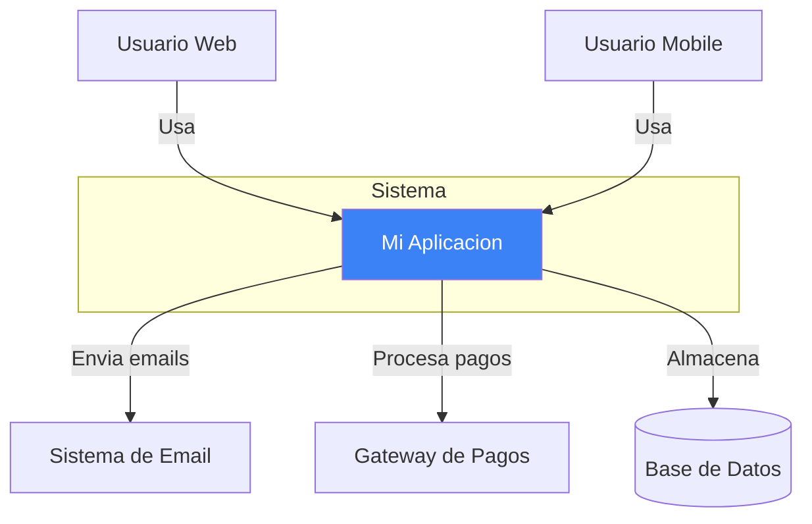
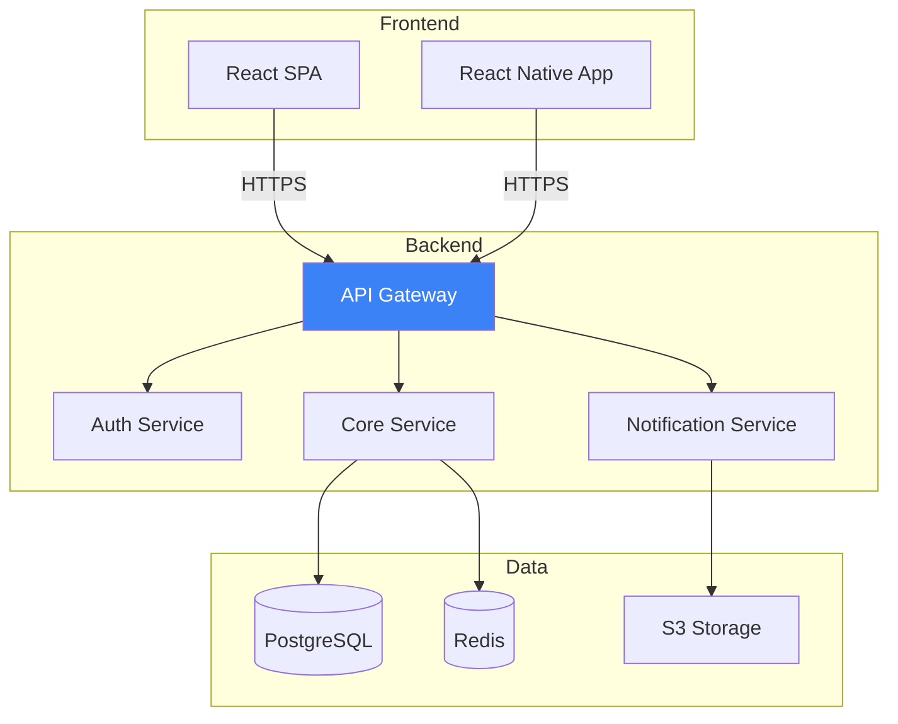
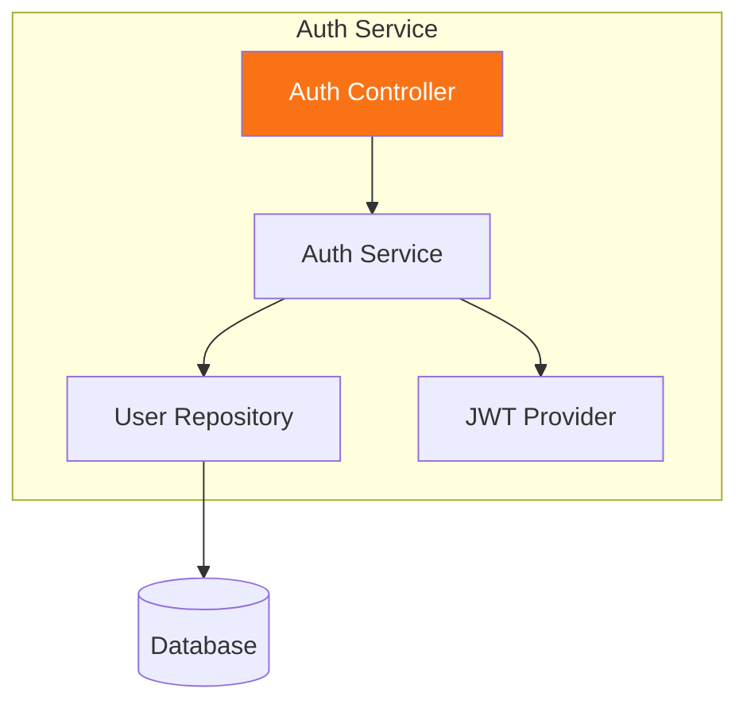
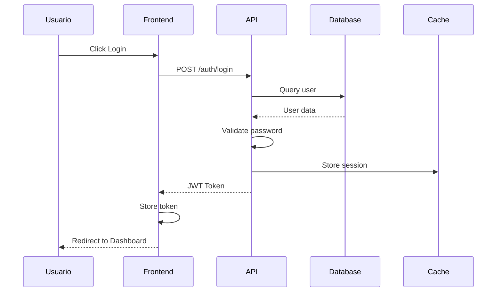
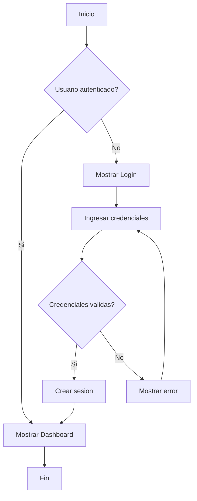
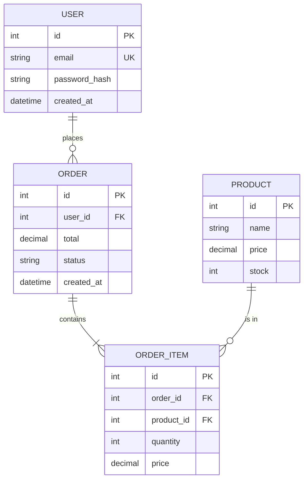
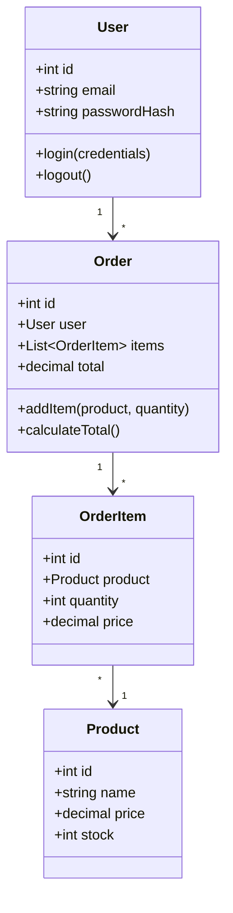
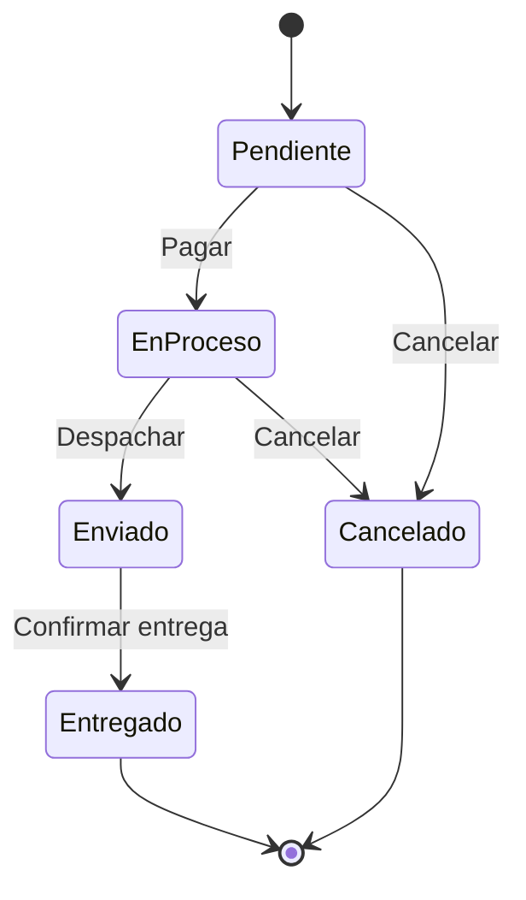

# SKILL: Diagramas Tecnicos

## Proposito
Crear diagramas tecnicos claros y profesionales para documentar
arquitectura, flujos y estructuras del sistema.

## Cuando se Activa
- Crear diagramas de arquitectura
- Disenar flujos de datos
- Modelar base de datos
- Documentar secuencias
- Visualizar componentes

## Instrucciones

### 1. Tipos de Diagramas

| Tipo | Uso | Herramienta |
|------|-----|-------------|
| C4 Context | Vista general del sistema | Mermaid/PlantUML |
| C4 Container | Componentes principales | Mermaid/PlantUML |
| C4 Component | Detalle de un container | Mermaid/PlantUML |
| Secuencia | Flujo de mensajes | Mermaid |
| Flujo | Procesos y decisiones | Mermaid |
| ERD | Modelo de datos | Mermaid |
| Clase | Estructura OOP | Mermaid |
| Estado | Maquina de estados | Mermaid |

### 2. Diagramas C4

#### Level 1: Context Diagram


#### Level 2: Container Diagram


#### Level 3: Component Diagram


### 3. Diagrama de Secuencia



### 4. Diagrama de Flujo



### 5. Diagrama ERD



### 6. Diagrama de Clases



### 7. Diagrama de Estados



### 8. Formato y Estilos

#### Colores NXT
```mermaid
%%{init: {'theme': 'base', 'themeVariables': {
  'primaryColor': '#3B82F6',
  'primaryTextColor': '#fff',
  'primaryBorderColor': '#1E40AF',
  'lineColor': '#6B7280',
  'secondaryColor': '#F97316',
  'tertiaryColor': '#8B5CF6'
}}}%%
```

#### Leyenda
- **Azul (#3B82F6)**: Componentes principales
- **Naranja (#F97316)**: Puntos de entrada
- **Purpura (#8B5CF6)**: Servicios externos
- **Verde (#10B981)**: Base de datos
- **Gris (#6B7280)**: Lineas de conexion

### 9. Proceso de Creacion

1. Identificar que se quiere comunicar
2. Elegir tipo de diagrama apropiado
3. Definir elementos principales
4. Establecer relaciones
5. Aplicar estilos NXT
6. Validar que sea comprensible
7. Exportar como SVG o PNG

## Comandos de Ejemplo

```
"Crea diagrama de arquitectura C4"
"Genera diagrama de secuencia para login"
"Crea ERD para el modulo de ordenes"
"Diagrama de flujo para checkout"
"Genera diagrama de componentes del API"
```

## Exportacion

Para exportar diagramas:

### Mermaid a SVG
```bash
npx mmdc -i diagram.mmd -o diagram.svg
```

### Mermaid a PNG
```bash
npx mmdc -i diagram.mmd -o diagram.png -w 1920 -H 1080
```

### PlantUML
```bash
java -jar plantuml.jar diagram.puml
```

## Ubicacion de Archivos

```
docs/
├── diagrams/
│   ├── architecture/
│   │   ├── c4-context.svg
│   │   ├── c4-container.svg
│   │   └── c4-component-auth.svg
│   ├── sequences/
│   │   ├── login-flow.svg
│   │   └── checkout-flow.svg
│   ├── data/
│   │   └── erd.svg
│   └── flows/
│       └── user-registration.svg
```
