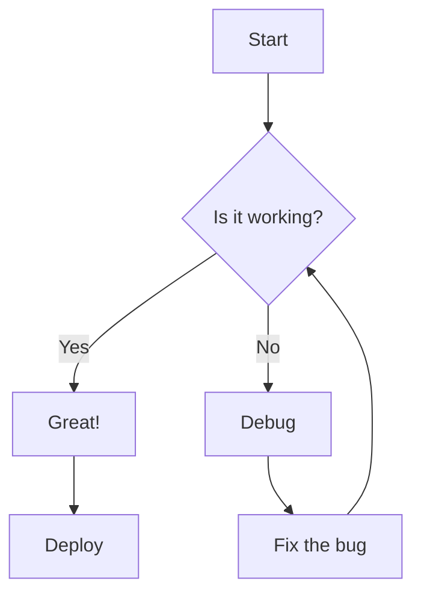
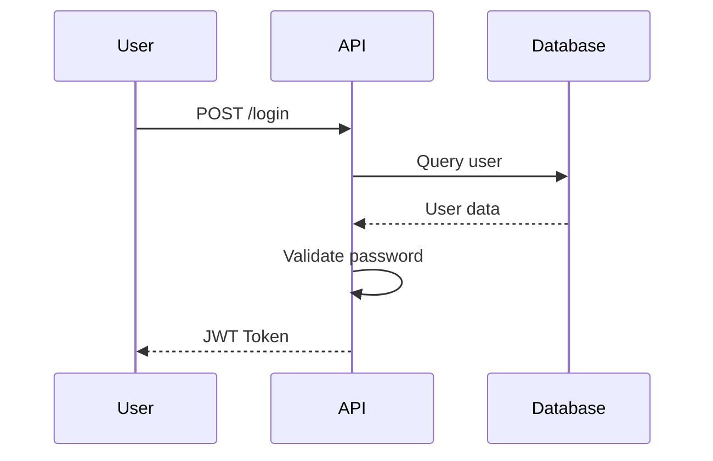
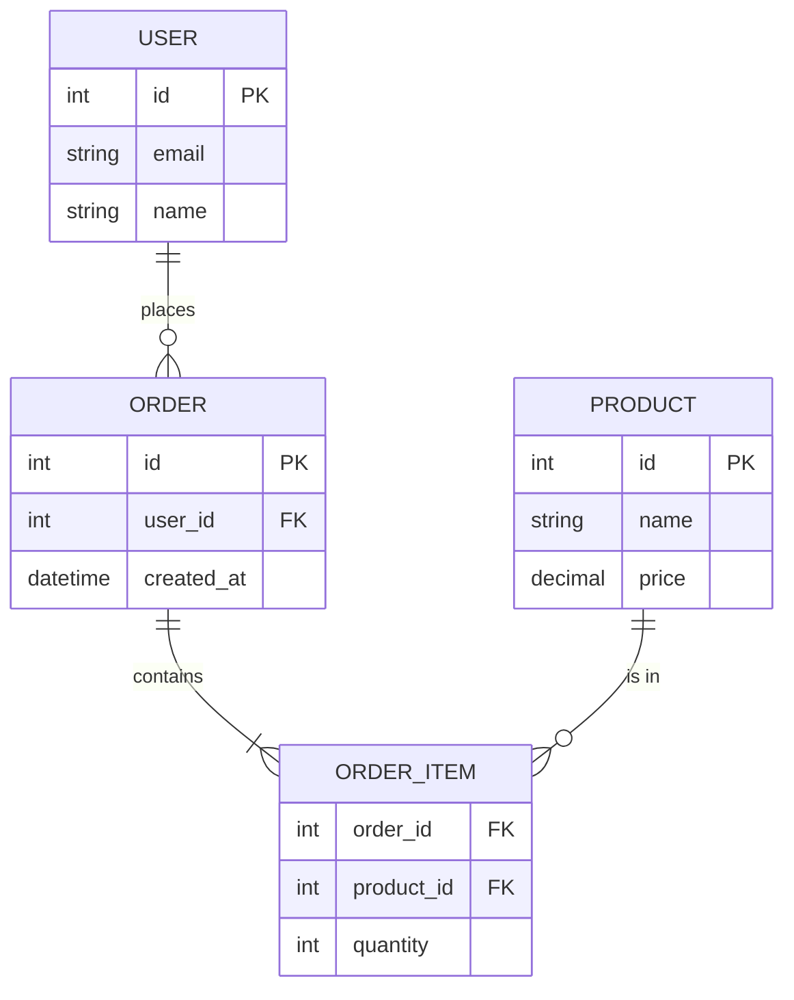
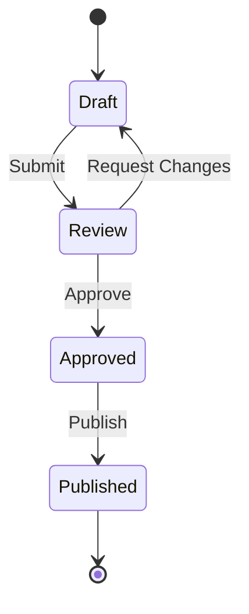

# SKILL: Markdown Avanzado

## Proposito
Crear documentacion tecnica avanzada usando Markdown extendido,
incluyendo diagramas, admonitions, tabs y componentes interactivos.

## Cuando se Activa
- Documentacion tecnica
- README profesionales
- Wikis y knowledge bases
- Docusaurus/VitePress
- MDX components

## Instrucciones

### 1. GitHub Flavored Markdown (GFM)

#### Tablas
```markdown
| Feature | Free | Pro | Enterprise |
|:--------|:----:|:---:|:----------:|
| Users   | 5    | 50  | Unlimited  |
| Storage | 1GB  | 10GB| 100GB      |
| Support | Email| Chat| 24/7 Phone |
| API     | -    | Yes | Yes        |

<!-- Alineacion: :--- izq, :---: centro, ---: der -->
```

#### Task Lists
```markdown
## Checklist de Release

- [x] Tests pasando
- [x] Code review completado
- [ ] Documentacion actualizada
- [ ] Changelog escrito
- [ ] Tag de version creado
```

#### Codigo con Sintaxis
````markdown
```typescript {2-4} title="src/utils.ts"
function calculateTotal(items: Item[]): number {
  return items.reduce((sum, item) => {
    return sum + item.price * item.quantity;
  }, 0);
}
```
````

#### Alertas/Admonitions (GitHub)
```markdown
> [!NOTE]
> Informacion util que los usuarios deberian conocer.

> [!TIP]
> Consejos utiles para hacer las cosas mejor.

> [!IMPORTANT]
> Informacion clave que los usuarios necesitan saber.

> [!WARNING]
> Contenido urgente que requiere atencion inmediata.

> [!CAUTION]
> Advierte sobre riesgos o consecuencias negativas.
```

### 2. Diagramas Mermaid

#### Flowchart
```markdown

```

#### Sequence Diagram
```markdown

```

#### Entity Relationship
```markdown

```

#### State Diagram
```markdown

```

### 3. Docusaurus MDX

#### Tabs
```mdx
import Tabs from '@theme/Tabs';
import TabItem from '@theme/TabItem';

<Tabs>
  <TabItem value="npm" label="npm" default>
    ```bash
    npm install @package/name
    ```
  </TabItem>
  <TabItem value="yarn" label="Yarn">
    ```bash
    yarn add @package/name
    ```
  </TabItem>
  <TabItem value="pnpm" label="pnpm">
    ```bash
    pnpm add @package/name
    ```
  </TabItem>
</Tabs>
```

#### Admonitions (Docusaurus)
```mdx
:::note
Some **content** with _Markdown_ syntax.
:::

:::tip Pro Tip
Use this pattern for better performance.
:::

:::info
This feature is available since v2.0.
:::

:::warning
This method is deprecated.
:::

:::danger Security Warning
Never expose your API keys.
:::

:::tip[Custom Title]
You can customize the title.
:::
```

#### Code Blocks Avanzados
```mdx
```jsx title="src/App.jsx" showLineNumbers {3-5}
import React from 'react';

function App() {
  // highlight-start
  const [count, setCount] = useState(0);
  // highlight-end

  return <button onClick={() => setCount(count + 1)}>{count}</button>;
}
```
```

#### Imports de Archivos
```mdx
import CodeBlock from '@theme/CodeBlock';
import MyComponent from '!!raw-loader!./MyComponent.tsx';

<CodeBlock language="tsx" title="MyComponent.tsx">
  {MyComponent}
</CodeBlock>
```

### 4. VitePress Features

#### Contenedores
```markdown
::: info
This is an info box.
:::

::: tip
This is a tip.
:::

::: warning
This is a warning.
:::

::: danger
This is a dangerous warning.
:::

::: details Click to expand
Hidden content here.
:::
```

#### Code Groups
```markdown
::: code-group

```js [config.js]
export default {
  name: 'project'
}
```

```ts [config.ts]
export default {
  name: 'project' as const
}
```

:::
```

### 5. README Template

```markdown
# Project Name

[](https://npmjs.com/package)
[](https://github.com/user/repo/actions)
[](https://codecov.io/gh/user/repo)
[](https://opensource.org/licenses/MIT)

> Short description of the project

## Features

- Feature 1 - Brief description
- Feature 2 - Brief description
- Feature 3 - Brief description

## Installation

```bash
npm install package-name
```

## Quick Start

```javascript
import { feature } from 'package-name';

const result = feature('input');
console.log(result);
```

## Documentation

| Topic | Link |
|-------|------|
| Getting Started | [docs/getting-started.md](docs/getting-started.md) |
| API Reference | [docs/api.md](docs/api.md) |
| Examples | [examples/](examples/) |

## Configuration

```javascript
// config.js
export default {
  option1: 'value',
  option2: true,
};
```

## Contributing

See [CONTRIBUTING.md](CONTRIBUTING.md) for guidelines.

## License

[MIT](LICENSE) - see LICENSE file for details.
```

### 6. Badges Utiles

```markdown
<!-- Status -->


<!-- Package -->


<!-- Social -->


<!-- Meta -->


```

### 7. Collapsible Sections

```markdown
<details>
<summary>Click to expand advanced configuration</summary>

### Advanced Options

| Option | Type | Default | Description |
|--------|------|---------|-------------|
| `debug` | boolean | false | Enable debug mode |
| `timeout` | number | 5000 | Request timeout in ms |

```javascript
// Example
const config = {
  debug: true,
  timeout: 10000
};
```

</details>
```

### 8. Keyboard Shortcuts

```markdown
Press <kbd>Ctrl</kbd> + <kbd>C</kbd> to copy.

On Mac, use <kbd>Cmd</kbd> + <kbd>V</kbd> to paste.
```

### 9. Definition Lists (HTML in MD)

```markdown
<dl>
  <dt>API Key</dt>
  <dd>A unique identifier used for authentication.</dd>

  <dt>Bearer Token</dt>
  <dd>A security token used in HTTP Authorization header.</dd>
</dl>
```

### 10. Checklist de Documentacion

- [ ] README con badges actualizados
- [ ] Instalacion clara
- [ ] Quick start funcional
- [ ] API documentada
- [ ] Ejemplos de codigo
- [ ] Changelog mantenido
- [ ] Contributing guide
- [ ] License file

## Comandos de Ejemplo

```
"Genera README profesional para este proyecto"
"Crea diagrama de arquitectura en Mermaid"
"Agrega tabs para diferentes package managers"
"Convierte esta documentacion a Docusaurus"
"Crea badges para el proyecto"
```
